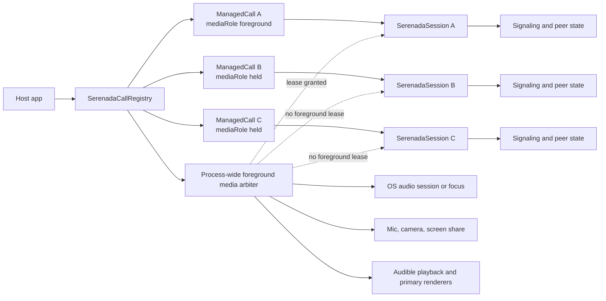
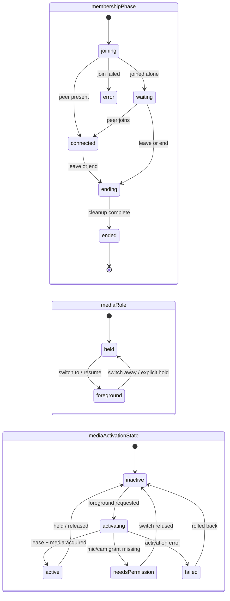
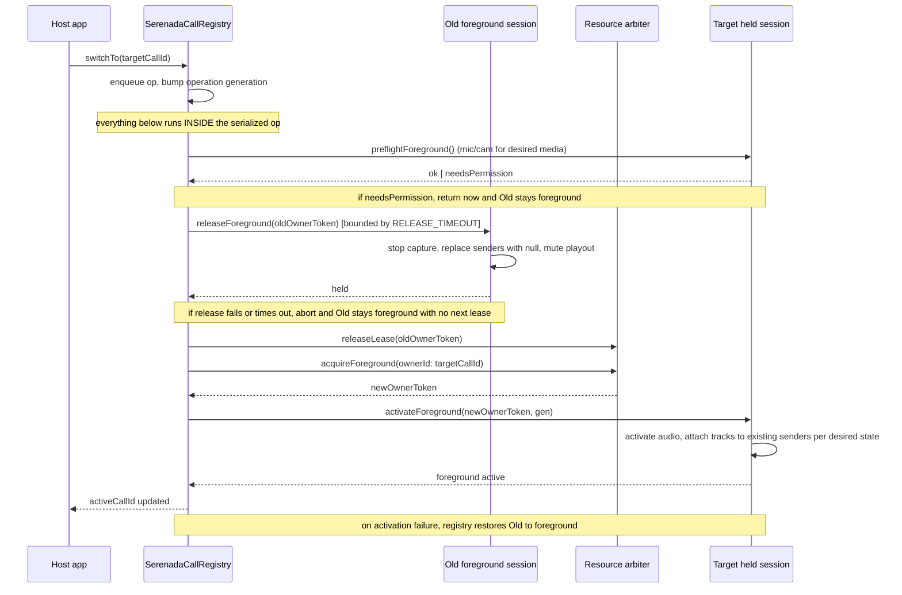

# Multi-Call Session Design

Status: Draft
Last updated: 2026-06-26

## Summary

This design extends the Serenada SDKs so a host app can keep multiple calls in
progress and switch between them. Version 1 intentionally supports only one
foreground media session at a time:

- one call can own microphone capture
- one call can own camera capture
- one call can own screen share
- one call can own OS audio routing/focus/session state
- one call can render as the active call UI

Other joined calls remain in a held state. Held calls keep enough signaling
state to stay in the room and recover quickly, but they do not own local media
capture, screen share, audio routing, or primary renderers.

The implementation should preserve the existing `SerenadaSession` API as the
single-call primitive and add a manager/registry layer above it. Existing
single-call integrations should continue to work unchanged.

### V1 Scope Slice

The smallest coherent slice that validates the hard architecture (one
foreground media owner, held calls stay joined, switching does not break
audio/camera ownership):

1. A **process-wide foreground media arbiter** with lease owner tokens and
   generation checks.
2. A **registry** with orthogonal state axes: membership phase, media role, and
   media activation state.
3. **Join with an initial media role**, so a registry-created call need not
   transiently own foreground media.
4. **Hold/resume media primitives** inside `SerenadaSession`.
5. **One active call** rendered by the existing single-session UI.

Explicitly deferred from v1 (see the relevant sections for rationale):

- multi-record recovery (recovery stays foreground-only)
- a full multi-call prebuilt UI

## Core Invariants

These are the non-negotiables. Every section below must uphold them; if a
section appears to contradict one, the invariant wins.

1. **Exactly one foreground lease per process.** One foreground media owner at
   any instant, enforced by a single process-global arbiter.
2. **Held sessions own no capture or playout.** A held session may stay
   signaled and connected, but owns no mic, camera, screen share, or audible
   remote playout.
3. **Initially-held sessions create stable transceivers/senders without
   capture.** Resume attaches local tracks to those existing senders; no SDP
   renegotiation on the common path.
4. **Switching preflights permissions before releasing the current foreground
   call.** If the target cannot activate with its desired media, the switch is
   refused and the current foreground call is left untouched.
5. **No auto-promote when the active call ends in v1.** Foreground resources are
   released, `activeCallId` becomes `nil`, held calls stay connected, and the
   host decides what to foreground next.
6. **Direct sessions and registry-managed calls cannot be mixed in the same
   process while either mode has live calls.** Enforced at the mode level, not
   just the foreground lease (a registry with only held calls still owns the
   process); the conflicting acquisition fails with a clear error.

## Architecture Diagrams

### Registry and Resource Ownership



### Orthogonal State Model

A managed call has **three independent state axes**. They must not be collapsed
into one enum: doing so leaks ambiguity into every platform implementation
(this design previously listed `held` as a `lifecycle` value while also saying
a call could be `inCall` and `held` at once, which is contradictory).

- `membershipPhase` describes room membership and connection only.
- `mediaRole` describes which call holds the foreground lease.
- `mediaActivationState` describes how foreground media activation is going.
  Permission state lives here, not in `membershipPhase`: needing a mic/camera
  grant is not a room-membership condition. A call can be `connected + held`
  and still need permission before it can become foreground.

`activeCallId` is derived: it is the id of the single call whose
`mediaRole == foreground`. At most one call may hold that role.



The axes change independently: a call can be `connected` (membership) while
`held` (role) with `mediaActivationState == inactive` (room alive, local media
suspended, UI elsewhere), or `connected` + `foreground` + `active`.
`mediaActivationState` is only meaningful for the call being foregrounded; held
calls sit at `inactive`.

### Platform Resource Ownership

```mermaid
flowchart TB
    Registry["SerenadaCallRegistry<br/>one foreground media lease"]

    subgraph Web["Web"]
        WebLease["Capture lease"]
        WebMic["getUserMedia microphone track"]
        WebCamera["getUserMedia camera track"]
        WebDisplay["getDisplayMedia screen share"]
        WebPlayback["Mounted audible media elements"]
        WebLease --> WebMic
        WebLease --> WebCamera
        WebLease --> WebDisplay
        WebLease --> WebPlayback
    end

    subgraph IOS["iOS"]
        IOSLease["Audio and capture lease"]
        IOSAudio["AVAudioSession sharedInstance"]
        IOSWebRTC["WebRTC audio device module"]
        IOSCamera["AVCapture camera pipeline"]
        IOSReplayKit["ReplayKit screen share"]
        IOSLease --> IOSAudio
        IOSLease --> IOSWebRTC
        IOSLease --> IOSCamera
        IOSLease --> IOSReplayKit
    end

    subgraph Android["Android"]
        AndroidLease["Foreground media lease"]
        AndroidFocus["Audio focus"]
        AndroidMode["MODE_IN_COMMUNICATION"]
        AndroidRoute["setCommunicationDevice or SCO"]
        AndroidService["CallService foreground types"]
        AndroidProjection["MediaProjection screen share"]
        AndroidLease --> AndroidFocus
        AndroidLease --> AndroidMode
        AndroidLease --> AndroidRoute
        AndroidLease --> AndroidService
        AndroidLease --> AndroidProjection
    end

    Registry --> WebLease
    Registry --> IOSLease
    Registry --> AndroidLease
```



## Problem

The SDK core APIs can create multiple session objects, but the current public
model and bundled apps assume a single active call:

- Web React helpers create or render one `SerenadaSessionHandle`.
- Android app state is built around one `activeSession` and one foreground
  `CallService` notification.
- iOS app state is built around one `activeSession`.
- Native `SerenadaSession` activation owns process-wide audio state through the
  default audio coordinator.
- `SerenadaCore.join(...)` starts local media as part of joining, so any
  second join transiently becomes a foreground media owner.
- Recovery storage persists one recoverable call record.

Supporting multiple calls requires separating logical call membership from
foreground media ownership. Without that split, two sessions can race over
global OS resources such as `AVAudioSession`, Android audio focus,
`MODE_IN_COMMUNICATION`, camera capture, MediaProjection, ReplayKit, Bluetooth
routing, and proximity behavior.

## Goals

1. Let host apps keep multiple Serenada calls joined or in progress.
2. Let the user switch the foreground media owner between calls.
3. Guarantee that only one call owns local capture and process-wide audio
   resources at a time.
4. Preserve existing single-call APIs and behavior by default.
5. Keep SDK packages headless; optional UI packages consume manager state but
   core SDKs do not depend on UI frameworks.
6. Keep server changes optional for v1.
7. Make held-call state compatible with older peers: old clients should at
   worst see audio/video disabled.

## Non-Goals

1. Mixing audio from multiple active calls.
2. Capturing microphone into more than one call at the same time.
3. Capturing camera into more than one call at the same time.
4. Simultaneous screen share across calls.
5. CallKit, Telecom, or OS-native call waiting integration inside the SDK.
   Host apps remain responsible for native call surfaces.
6. SFU-style media routing or server-side media mixing.
7. Full background-call UI in the prebuilt call flow. V1 exposes state and
   primitives; host apps can build their own switcher.
8. Multi-record recovery across app restarts. V1 recovery stays foreground-only
   (see Recovery).

## Current Architecture

### Shared

`SerenadaCore.join(...)` returns a `SerenadaSession`. A session owns signaling,
media, state publication, recovery, peer negotiation, stats, and quality
tracking for one room.

The public session APIs are call-local:

- `leave()`
- `end()`
- audio/video toggles
- camera switching
- screen share
- renderer attachment
- diagnostics/state observation

There is no call registry, active-call id, hold/resume primitive, or resource
lease model.

### Web

`SerenadaSession` constructs a `MediaEngine` and starts media as part of the
join flow. Audio mute toggles the local audio track. Video disable can release
the camera track, but there is no equivalent public suspend primitive for the
microphone.

React UI components render one session. A host can pass an external session,
but the prebuilt flow still operates on a single session.

### Android

`SerenadaCore.join(...)` creates a `SerenadaSession`, starts it immediately,
and returns it. The session activates the audio coordinator before starting
local media. The bundled app's `CallManager` stores one `activeSession` and one
set of observers. `CallService` has one notification id and one
MediaProjection-ready flag.

### iOS

`SerenadaCore.join(...)` creates a `SerenadaSession` that begins joining from
initialization. The session activates the audio coordinator and starts local
media during `prepareMediaAndConnect()`. The bundled app's `CallManager` stores
one `activeSession` and routes UI, push join snapshots, and history around that
single session.

## Proposed Model

Introduce a manager layer above sessions:

```text
SerenadaCallRegistry
  calls: Map<CallId, ManagedCall>
  activeCallId: CallId?   // derived: the call with mediaRole == foreground
  joinHeld(room) -> JoinResult            // join without taking foreground
  joinAndSwitch(room) -> JoinAndSwitchResult  // join held, then switch to it
  switchTo(callId) -> SwitchResult
  hold(callId)
  leave(callId)
  end(callId)
```

All mutating operations are async (suspend on Android, `async` on iOS,
`Promise` on web) because they can touch the foreground lease and OS media with
timeouts and real failure modes. Result types carry enough to act on:

```text
JoinResult           = joined(callId) | failed(callId?, error)
SwitchResult         = active | needsPermission | failed(error)
JoinAndSwitchResult  = active(callId)
                     | needsPermission(callId)   // held call exists; host prompts then switchTo(callId)
                     | failed(callId?, error)     // callId present if the held call was created
```

`needsPermission(callId)` must carry the `CallId`: the held call already exists,
and the host needs to know which call to prompt for and retry with
`switchTo(callId)`.

The two join entry points are composites over the registry-internal join (see
Registry Operation Semantics). There is no public `join(initialMediaRole)` on the
registry: a host either joins in the background (`joinHeld`) or joins and
foregrounds (`joinAndSwitch`), which keeps the foreground-lease handling entirely
inside the registry.

The manager owns call-level orchestration. Each `SerenadaSession` remains the
per-room engine.

### Managed Call

```text
ManagedCall
  id: CallId
  roomId: String
  roomUrl: URL/String?
  session: SerenadaSession
  membershipPhase: joining | waiting | connected | ending | ended | error
  mediaRole: foreground | held
  mediaActivationState: inactive | activating | active | needsPermission | failed
  // desired media intent (set by the user, survives hold)
  desiredAudioEnabled: Bool
  desiredVideoMode: VideoMode      // off | selfie | world | composite
  // actual published state (what peers observe right now)
  actualAudioPublished: Bool
  actualVideoPublished: Bool
  joinedAtMs: Int64
  lastActivatedAtMs: Int64?
  displayName: String?
```

`membershipPhase` describes room membership, `mediaRole` describes who holds the
foreground lease, and `mediaActivationState` describes foreground activation
progress (including permission state). The three are orthogonal (see Orthogonal
State Model).

**Desired vs actual media state.** Holding a call must not mutate the user's
intent. If the user was unmuted with the world camera before hold, resuming
foreground must restore that intent, not silently leave them muted.
`desired*` fields capture intent and are only changed by explicit user action.
`actual*` fields reflect what is published to peers right now; a held call
always has `actualAudioPublished == false` and `actualVideoPublished == false`
regardless of intent.

### Session Media Role

The session exposes a media role, but **role mutation is registry-owned, not a
casual public API**. If any host could call `session.setMediaRole(foreground)`
directly, the registry could no longer guarantee single ownership.

Foreground activation is gated behind an owner token issued only by the resource
arbiter:

```text
// internal contract, not part of the public single-call surface
session.preflightForeground() -> ok | needsPermission | failed
session.activateForeground(ownerToken, operationGeneration)  // -> foreground; throws on failure
session.abortForegroundActivation(ownerToken)                // undo a partial/failed activation
session.releaseForeground(ownerToken)                         // -> local resources held; idempotent, never throws
```

`releaseForeground` is **idempotent and must not throw after partial release**:
once called it drives the session to a fully-held state (capture stopped, senders
nulled, playout muted) and is safe to call again. `abortForegroundActivation`
undoes a `activateForeground` that started capture/audio before failing, leaving
the session held. These guarantees are what let the switch algorithm reason about
failure without leaking half-activated media (see Switch Operation).

`ownerToken` is opaque and only the arbiter can mint it (see Process-Wide
Resource Arbiter). `operationGeneration` is passed explicitly into
`activateForeground` so the session can fence stale async activation callbacks.
**A late callback must match both the current generation and the current lease
owner token** to be honored; failing either, it is discarded. Generation alone is
insufficient: rollback re-activates the old call, and a stuck callback from the
failed new activation could otherwise still match the live generation. The
generation is therefore bumped for *every* activation attempt, including rollback
(see Switch Operation), and the owner-token check is the second, independent
fence. A direct caller without a valid token cannot move a session into
`foreground`. Public single-call integrations never see these methods; they
continue to use `join()`/`leave()` and the existing audio/video toggles.

**Lease-release ownership.** The registry, not the session, is the only caller
that releases an arbiter lease. `session.releaseForeground(ownerToken)` uses the
token only to prove it is draining the current foreground owner and to fence
late callbacks; after it confirms the session is fully held, the registry calls
`arbiter.releaseLease(ownerToken)`. This keeps lease ownership centralized and
avoids split-brain cleanup paths during switch failure handling.

**`preflightForeground()` semantics.** Preflight is a pure check: it must **not**
open a permission prompt and must **not** start capture. It inspects current
permission state for the call's desired media and returns:

- `needsPermission` if a *required* device permission is not already granted
  (on web, where permission state can read as `prompt`/unknown, treat
  not-granted as `needsPermission`).
- `ok` otherwise. If `desiredAudioEnabled` is false and `desiredVideoMode` is
  `off`, no device permission is required, so missing mic/camera permission does
  **not** block the switch (a fully muted, camera-off call can foreground
  without prompts).
- `failed` for non-permission preconditions (for example, no audio route).

The host is responsible for requesting permission (its own prompt flow) and then
retrying the switch.

Foreground media means:

- audio coordinator active
- audio session/controller active
- microphone capture available if `desiredAudioEnabled` and audio policy allow
- camera capture available if `desiredVideoMode != off` and video policy allow
- screen share can start
- remote audio playout enabled
- renderers may be attached

Held media means:

- screen share stopped
- microphone capture released or disabled strongly enough that the OS no
  longer reports this session as capturing
- camera capture released
- `actualAudioPublished` / `actualVideoPublished` broadcast as `false`
- remote audio playout disabled
- visible renderers detached or paused
- signaling remains connected when possible
- peer connection identity preserved (see Peer-Connection Suspension Strategy)

### Join With Initial Media Role (Registry-Internal)

Because `join()` starts local media, a registry that simply calls
`core.join(...)` would create a second foreground media owner before it has a
chance to hold the existing call. Joining therefore needs an initial media role:

```text
// registry/internal entry point, NOT a public join() parameter
coreInternal.join(room, initialMediaRole: foreground | held)
```

**Initial role is registry/internal, not a public `join()` knob.** The public
`SerenadaCore.join()` signature is unchanged and always joins `foreground`; that
is the only role single-call hosts can request. Exposing `initialMediaRole:
held` publicly would let a host create a held session with no public way to
foreground it (foregrounding requires the arbiter lease, which only the registry
holds). Public held joins are supported only through `SerenadaCallRegistry`.

- Registry joins either acquire the foreground lease first (then join as
  `foreground`) or create the session in `held` mode and never transiently own
  foreground resources. A session created as `held` does not activate the audio
  coordinator and does not start local capture.
- **Transceiver policy (Core Invariant 3).** A session joined as `held` still
  creates stable audio and video transceivers/senders during negotiation, but
  attaches no local capture tracks (the senders carry a `null` track). Resume
  attaches freshly acquired tracks to those existing senders via `replaceTrack`,
  with no SDP renegotiation on the common path. If a platform cannot create a
  stable sender without an attached track, that platform documents its
  renegotiate-on-resume path explicitly in its section below; none is expected
  for the WebRTC builds in use.

### Peer-Connection Suspension Strategy

V1 commits to one contract across platforms (the prior "may remain alive / can
evolve" wording was not implementation-ready):

- keep signaling connected and preserve peer connection identity, stable
  audio/video transceivers/senders, and the reconnect token (a call held from
  the start already has these senders; see Transceiver policy above)
- stop screen share
- replace local audio and video **sender tracks** with `null` or inactive
  tracks (do not just toggle `track.enabled`; the OS may keep capture live)
- preserve `desiredAudioEnabled` / `desiredVideoMode` separately so resume can
  restore intent
- on resume, reacquire tracks from the foregrounded capture pipeline and
  replace the senders again
- renegotiation: replacing a sender's track with a same-kind track does **not**
  require renegotiation on any of the three platforms, and attaching a fresh
  same-kind track after releasing it to `null` is also handled by `replaceTrack`
  without an SDP round trip. If a platform path is found to need renegotiation,
  that is an accepted resume-latency cost and must be documented in that
  platform's section, not papered over.

V1 prioritizes correctness of OS resource ownership over keeping every RTP path
warm.

### Registry Operation Semantics

Every public registry operation runs inside the single serialized operation
queue. This table is the contract; the prose and pseudocode below elaborate it.

```text
operation        foreground effect          failure behavior
joinHeld         none (creates held call)   call enters error; no active change
joinAndSwitch    old -> held, new active    roll back old to foreground if any
                                            stage after old-release fails;
                                            if old-release fails, never release
                                            old lease
switchTo         old -> held, next active   roll back old to foreground; if
                                            old-release fails, abort, keep old
hold(active)     active -> held             activeCallId = nil
hold(held)       no-op                      n/a
leave/end active release foreground, then   cleanup proceeds; no auto-promote
                 leave/end
leave/end held   signaling cleanup only     no arbiter interaction beyond
                                            verifying it holds no lease
```

**Composite join operations.** The common user flows create a *new* call rather
than switching between existing ones, so the registry exposes composite
operations on top of the registry-internal join:

```text
joinHeld(room) -> JoinResult
  queued section A (short): callId = create managed call, register (mode guard, dedup)
  outside queue: join room as held, bounded by JOIN_TIMEOUT (cancellable)
  if join fails/timeout: mark call error; return failed(callId, error)  // no active change
  return joined(callId)

joinAndSwitch(room) -> JoinAndSwitchResult
  queued section A (short): callId = create managed call, register (mode guard, dedup)
  outside queue: join room as held, bounded by JOIN_TIMEOUT (cancellable)
  if join fails/timeout: mark call error; return failed(callId, error)  // old untouched
  queued section B: run the switchTo(callId) body:
    if needsPermission: return needsPermission(callId)   // old untouched
    if old-release fails: return failed(callId, releaseError)  // old stays foreground
    if activation fails: roll back old; return failed(callId, activationError)
    return active(callId)
```

Between sections A and B another queued operation (for example a `leave` of the
old active call) may run; section B re-reads `activeCallId` rather than assuming
the world is unchanged.

Each stage names its rollback: room-create/join failure leaves the previous
active call untouched (the new call never reached foreground); permission and
release/activation failures follow the same rules as `switchTo`.

**`hold(callId)`.**

- Holding the **active** call first drains the session's foreground resources,
  then the registry releases the foreground lease and sets `activeCallId = nil`.
  No other call is auto-promoted (Core Invariant 5).
- Holding an **already-held** call is a no-op.
- Holding the **only** call keeps room membership (`connected`) but leaves no
  active UI session; the host renders an empty/holding state.
- Held calls never auto-resume; only an explicit `switchTo`/`joinAndSwitch`
  foregrounds a call.

**`leave(callId)` / `end(callId)`.**

- For the **active** call: first drain foreground resources and release the
  registry-owned foreground lease, then run the existing leave/end teardown.
  `activeCallId` becomes `nil`; held calls remain connected and are not
  auto-promoted.
- For a **held** call: leave/end performs signaling/room cleanup only and must
  not touch the arbiter beyond asserting that the held call holds no lease
  (defense against a leaked lease).

### Switch Operation

All registry operations are serialized through a single operation queue (see
Registry Operation Serialization), not just `switchTo`. **Preflight runs inside
the queued operation**, not before it, so it cannot race a concurrent
switch/leave/end; it simply avoids touching the old call until after preflight
passes. Pseudocode:

```text
switchTo(nextCallId):
  if nextCallId == activeCallId:
    return

  old = calls[activeCallId]
  next = calls[nextCallId]

  enqueue registry operation:
    registryOperationInProgress = true
    gen = arbiter.nextOperationGeneration()   // fences stale async callbacks

    // 0. PREFLIGHT (inside the queued op): can the target activate with its
    //    desired media, WITHOUT touching the old call yet?
    permission = next.session.preflightForeground()   // checks mic/cam grant
                                                       // for desired state
    if permission == needsPermission:
      next.mediaActivationState = needsPermission
      registryOperationInProgress = false
      return needsPermission        // old foreground call untouched

    // 1. drain old session-local foreground resources using ITS existing owner
    //    token, bounded by a timeout. releaseForeground is idempotent and
    //    cannot throw after partial release.
    stop screen share on old if active
    ok = withTimeout(RELEASE_TIMEOUT): old.session.releaseForeground(old.foregroundToken)
    if not ok:   // timed out: release did not confirm fully-held
      // CORE INVARIANT 1: do NOT acquire the next lease if old may still own it.
      old.mediaActivationState = failed   // unknown/partial; lease NOT released
      registryOperationInProgress = false
      surface recoverable releaseError on old   // activeCallId unchanged (old)
      return switchFailed
    arbiter.releaseLease(old.foregroundToken)   // registry frees lease only after confirmed held
    old.foregroundToken = nil
    old.mediaRole = held

    // 2. acquire a NEW owner token for next, then activate (bounded)
    try withTimeout(ACTIVATE_TIMEOUT):
      newToken = arbiter.acquireForeground(ownerId: nextCallId)
      next.foregroundToken = newToken
      next.session.activateForeground(newToken, gen)   // gen + token fence callbacks
      next.mediaRole = foreground
      activeCallId = nextCallId
    catch activationError | timeout:
      // clean up the partially-activated target before touching the lease
      next.session.abortForegroundActivation(next.foregroundToken)
      arbiter.releaseLease(next.foregroundToken); next.foregroundToken = nil
      // 3. roll back to old by default, under a FRESH generation
      rollbackGen = arbiter.nextOperationGeneration()
      try withTimeout(ACTIVATE_TIMEOUT):
        old.foregroundToken = arbiter.acquireForeground(ownerId: old.id)
        old.session.activateForeground(old.foregroundToken, rollbackGen)
        old.mediaRole = foreground
        activeCallId = old.id
        surface recoverable activationError on next
      catch rollbackError | timeout:
        if old.foregroundToken: old.session.abortForegroundActivation(old.foregroundToken)
        activeCallId = nil
        surface both activationError and rollbackError

    registryOperationInProgress = false
    publish manager state
```

`RELEASE_TIMEOUT`, `ACTIVATE_TIMEOUT`, and `JOIN_TIMEOUT` bound each media
transition and the held room join so a stuck session cannot freeze the serialized
queue forever. They are added to `constants.ts` and the per-platform
resilience-constants files and checked by `scripts/check-resilience-constants.mjs`.
On timeout the operation fails as above rather than hanging.

Two distinct token concepts (the prior draft conflated them):

- **Lease owner token.** Identifies the current holder of the single foreground
  lease. The old call drains session-local foreground resources with the token
  it already holds; the registry releases that lease only after the drain is
  confirmed. The new call acquires a *fresh* owner token from
  `arbiter.acquireForeground(ownerId)`. Releasing with a stale token, or
  acquiring while another token is live, is an arbiter error.
- **Operation generation.** A monotonic counter bumped per switch, used only to
  discard stale async activation callbacks from a superseded switch. It is not
  the lease identity.

**Preflight before releasing the old call (Core Invariant 4).** Permissions are
checked on the target *before* the old call is touched. If the target needs a
mic/camera grant for its desired media, the switch returns `needsPermission` and
leaves the current foreground call fully active. This avoids a hold-then-fail
flow where the user is left media-less while a system permission prompt is on
screen.

**Old-release failure cannot break the single-lease invariant.**
`releaseForeground` is idempotent and cannot throw after partial release, so the
normal failure mode is a *timeout* (the release did not confirm a fully-held
state in `RELEASE_TIMEOUT`), not a half-released call. On that timeout the arbiter
does **not** release the old lease and does **not** grant the next one (that would
risk two foreground owners). The old call is marked `mediaActivationState =
failed` to flag that its media may be in an unknown/partial state, but it retains
the lease; the switch aborts and the host can retry (a retry re-runs the
idempotent release). This is the one failure where the user keeps the call they
were on rather than landing on the target.

**Switch failure rolls back by default.** If activation fails after preflight
passed (for example, the OS audio session refuses to activate), the manager
restores the old call to foreground. Only if rollback also fails does it surface
both errors with no active foreground owner.

### Foreground Switch Sequence



### Held State Signaling

For v1, no server change is required. Use existing peer message relay for an
additive state, carried as an extension of `participant_media_state`:

```json
{
  "audioEnabled": false,
  "videoEnabled": false,
  "held": true
}
```

Ordering and replay rules (these are part of the contract, not left to each
platform):

- **Unknown-field behavior.** All clients must ignore unknown fields in
  `participant_media_state`. Older clients ignore `held` and render the
  participant as muted with camera off. New clients render "on hold" distinctly.
- **Send ordering on hold.** The hold operation completes only after local
  capture is stopped **and** the held state has been sent. Sending order is
  local-stop-then-broadcast. This does not promise remote observers a perfectly
  atomic transition: the signaling message travels the network and may arrive
  after the media has already gone silent. The guarantee is local-side ordering,
  not remote atomicity. Because the held broadcast also sets
  `audioEnabled: false` / `videoEnabled: false`, an older peer that races the
  message still degrades only to muted/camera-off, never to a wrong "live"
  state.
- **Send ordering on resume.** Attach tracks to the existing senders **first**,
  then broadcast `held: false` with the resumed `audioEnabled`/`videoEnabled`
  derived from desired state. Same caveat: the ordering is local; the remote
  peer converges when the message arrives.
- **New peer joining a held participant.** Held state is part of the
  participant's current media state, so it is included in the media-state
  exchange a newly joined peer receives, the same way mute state is today.
- **Reconnect.** After a signaling reconnect, the current
  `participant_media_state` (including `held`) is re-broadcast as part of
  post-reconnect state resync, so peers that missed the original message
  converge.

When resuming foreground media, send:

```json
{
  "audioEnabled": "<desiredAudioEnabled and route availability>",
  "videoEnabled": "<desiredVideoMode != off and camera availability>",
  "held": false
}
```

## Shared SDK Implementation

### 1. Add `SerenadaCallRegistry`

Add a cross-platform manager with matching semantics:

- Web: `client/packages/core/src/SerenadaCallRegistry.ts`
- Android: `client-android/serenada-core/.../SerenadaCallRegistry.kt`
- iOS: `client-ios/SerenadaCore/Sources/SerenadaCallRegistry.swift`

The manager should:

- create sessions through `SerenadaCore`, passing an explicit
  `initialMediaRole`
- keep calls keyed by a stable `CallId`
- publish aggregate call state
- serialize all operations through a single queue (see below)
- keep one `activeCallId` derived from the single `foreground` call
- expose per-call leave/end
- forward session state changes into manager state
- remove ended calls after a configurable retention period or explicit dismiss

Use `SerenadaCallRegistry` rather than `CallManager` in SDK packages to avoid
conflict with existing host-app classes named `CallManager`.

#### Registry Operation Serialization

`join`, `switchTo`, `hold`, `leave`, `end`, permission completion, app
backgrounding, and remote-ended events can all interleave and all touch the
foreground lease or the call map. **All** of them, not just `switchTo`, must run
through a single serialization mechanism per platform:

- Web: a promise-chained operation queue on the registry
- iOS: `@MainActor` plus a serial task/flag so operations cannot interleave
  audio activation and deactivation
- Android: a `Mutex` on `Dispatchers.Main.immediate`

The queue serializes **foreground-lease and call-map mutations**, not slow
network I/O. A held room join can take seconds; holding the queue across it would
block urgent operations (`leave`, `end`, remote-ended, app backgrounding) behind
it. So a composite like `joinAndSwitch` runs in three parts: (1) a short queued
critical section that creates and registers the managed call (mode guard, dedup),
(2) the held room join performed **outside** the queue with a join
timeout/cancellation path, then (3) a second queued critical section for the
switch (preflight, release old, activate new). Each queued section runs to
completion (including its arbiter calls) before the next begins;
`registryOperationInProgress` is exposed in state for UI.

#### Call Identity Policy

The registry defines:

- **One live call per `roomId`.** The registry rejects a second live join for a
  `roomId` that already has a non-ended managed call; it returns the existing
  `CallId` instead (idempotent join by room).
- **Room identity is canonicalized before comparison.** Hosts pass either a room
  URL or a room id. The registry derives the canonical `roomId` the same way for
  both: extract the room token from the URL path (`/call/<token>`) when a URL is
  given, ignore scheme/host/query/fragment and trailing slashes, and use the
  resulting token as the dedup key. Both `serenada.app` and `serenada-app.ru`
  URLs for the same token therefore canonicalize to one `roomId`, so equivalent
  URLs do not slip past duplicate prevention. This reuses the existing room-token
  parsing already shared across platforms; it does not introduce a new format.
- **CallId ownership.** `CallId` is registry-generated and stable for the life
  of the managed call. Hosts may supply a correlation/display key, but it is not
  the identity key.
- **Recovering a live call is a no-op join.** Attempting to recover/rejoin a
  room that already has a live managed call resolves to that existing call
  rather than creating a duplicate.

### 2. Split Session Leave From Hold

Do not overload `leave()` for hold. `leave()` must keep its current meaning:
send leave, tear down the room membership, and end the session.

Add a separate hold/suspend path (reached via `releaseForeground(ownerToken)`)
that:

- does not call `leaveRoom()`
- does not clear reconnect identity
- does not destroy the session object
- does not finalize call quality
- does stop local foreground media ownership

This is the main refactor inside `SerenadaSession`.

### 3. Add Local Media Suspension Primitives

Each media engine needs explicit foreground-resource methods:

```text
suspendLocalMediaForHold()      // stop capture, replace senders with null/inactive
resumeLocalMediaFromHold()      // reacquire per desired state, replace senders
setRemotePlaybackEnabled(enabled)
detachOrPauseRenderersForHold()
```

Implementation details are platform-specific, but the contract is shared:
after suspension, the session must not own mic, camera, screen share, or
audible remote playback, and must preserve desired media intent for resume.

**Remote playout suppression — concrete mechanism per platform.** "Disable
remote audio playout" is a requirement, not a design, so each platform names how
it actually silences the held call's remote audio. This is a real risk area
(half-muted held calls are a classic bug):

- **Web:** the registry exposes `activeCallId` and React UI mounts the audible
  `<audio>`/`<video>` element only for the active session; held sessions have
  no audible sink mounted. As defense in depth, the held session also sets
  `receiver.track.enabled = false` on remote audio receivers so a host that
  hand-mounts streams still gets silence.
- **iOS:** set the remote audio `RTCAudioTrack.isEnabled = false` on the held
  session's receivers, and rely on the foreground-only `AVAudioSession`
  activation so the WebRTC audio device module is not driving output for held
  calls. Both together, since a deactivated session must not depend on the audio
  unit state alone.
- **Android:** set the remote `AudioTrack.setEnabled(false)` on the held
  session's receivers; the foreground-only audio focus / `MODE_IN_COMMUNICATION`
  ownership means held calls do not route audio.

Resume re-enables the receiver tracks (and, on web, re-mounts the audible
element for the now-active call).

### 4. Add a Process-Wide Resource Arbiter

There is **exactly one arbiter per app process (per JS execution context on
web)**, shared by all `SerenadaCore` instances and all `SerenadaCallRegistry`
instances. "Per SDK runtime" or "per-`SerenadaCore` singleton" is too weak: OS
audio session, audio focus, mic, and camera are process-global, so a per-core or
per-registry arbiter would still let two cores race. The arbiter is a true
process singleton, and every code path that touches foreground media, including
the existing single-call APIs, acquires and releases its lease through it.

**Mixed registry and direct-session use is unsupported in v1 (Core Invariant
6), enforced at the mode level, not just the lease level.** A foreground-lease
check alone is insufficient: a registry could hold only *held* calls with no
foreground owner, and a direct `SerenadaCore.join()` would then acquire the lease
and bypass the registry entirely. So the arbiter tracks an **owning mode**, set
on first use:

- The first `SerenadaCallRegistry` to operate claims `registry` mode for the
  process. While a registry exists with any non-ended managed call (foreground
  or held), direct `SerenadaCore.join()` fails fast with
  `foregroundLeaseUnavailable`.
- A direct `SerenadaCore.join()` claims `direct` mode. While a direct session is
  live, constructing/operating a registry that would acquire the lease fails
  with the same error.
- The mode clears when the owning side has no live sessions/calls, after which
  the other mode may claim it.

A host integrates through direct single-call APIs *or* the registry, not both at
once. (Letting direct sessions coexist as standalone foreground owners alongside
registry-held calls is possible later, but adds arbitration rules we do not want
to commit to in v1.)

Responsibilities:

- grant at most one foreground media lease at a time via
  `acquireForeground(ownerId)`, returning a unique owner token
- reject a second `acquireForeground` while a lease is live
  (`foregroundLeaseUnavailable`); reject `releaseLease` with a token that is
  not the current owner's
- never grant a new lease while a previous owner's release is pending or failed
  (so an old-release failure cannot produce two owners)
- track the owning mode (`registry` vs `direct`) and reject cross-mode
  acquisition while the owning mode has live sessions/calls
- vend a monotonic operation generation (`nextOperationGeneration()`), separate
  from the owner token, passed into `activateForeground` so stale async
  activation callbacks from a superseded switch can be discarded
- activate/deactivate the audio coordinator in ordered pairs
- serialize screen-share ownership
- provide diagnostics when activation/release fails or times out

Web does not need OS audio focus, but it still needs a capture lease so only
one session holds `getUserMedia()` tracks at a time, minted by the same arbiter
abstraction.

### 5. Recovery (Foreground-Only for V1)

Multi-record recovery is **deferred**. It is orthogonal to live multi-call
switching and adds storage migration, expiry, stale foreground-role handling,
duplicate records, rejoin ordering, and UI decisions. Bundling it into v1 would
delay validating the hard part (the arbiter + registry + role model) without
de-risking it.

V1 keeps recovery as a single foreground-only record, unchanged in shape:

```text
RecoveryRecord
  roomId
  cid
  reconnectToken
  lastEpoch
  sessionStartTs
  expiresAtMs
```

Only the foreground call writes a **durable** recovery record. Held calls keep
their **in-memory** reconnect identity (CID, reconnect token, epoch) for the
life of the process, which is what lets a switch-back rejoin without a full
leave/rejoin. They do not write a durable recovery record: after an app restart,
held calls are gone and the host can re-offer the last active call. The
distinction matters because "held session does not clear recovery identity"
(an iOS test) refers to the in-memory reconnect state, not durable storage.
This is an accepted v1 limitation, called out in docs.

Multi-record recovery (keyed by `CallId`, with `getRecoverableSessions()` /
`discardRecoverableSession(callId)`) is a fast-follow once the registry and
arbiter are proven. The recovery record schema leaves room to add a `callId`
key without a breaking migration.

### 6. State and Diagnostics

Add manager-level state instead of forcing every app to infer it from sessions:

```text
CallRegistryState
  calls: [ManagedCallState]
  activeCallId: CallId?
  registryOperationInProgress: Bool   // any queued op (join/switch/hold/leave/end) running
  lastError: CallRegistryError?       // registry-level, e.g. mode conflict
```

Each `ManagedCallState` should include:

- call id
- room id/url
- membership phase
- media role
- media activation state (incl. `needsPermission`)
- per-call `activationError` (failed activation, failed release, failed/timed-out
  join, or the permission that is needed) — registry-level `lastError` is not
  enough once multiple calls exist
- desired audio/video intent
- actual published audio/video
- participant count
- local cid
- held flag
- display name
- quality summary after end

Do not hide the underlying `SerenadaSession`; host apps still need access to
per-call diagnostics and custom rendering.

## Web Implementation Shape

### Files

- `client/packages/core/src/SerenadaCallRegistry.ts`
- `client/packages/core/src/types.ts`
- `client/packages/core/src/SerenadaSession.ts`
- `client/packages/core/src/media/MediaEngine.ts`
- `client/packages/react-ui/src/hooks/useSerenadaCallRegistry.ts`
- optional later: `client/packages/react-ui/src/SerenadaMultiCallFlow.tsx`

### Core Changes

`SerenadaCallRegistry` should wrap a `SerenadaCore` instance and call the
registry-internal join with an explicit `initialMediaRole` for each managed
call. The public `core.join()` is untouched and remains foreground-only.

The web `MediaEngine` needs stronger local-media suspension:

- stop screen share if active
- stop local camera track
- stop local microphone track
- replace audio/video senders with `null` or inactive tracks (do not rely on
  `track.enabled = false`; the browser may keep capture active)
- broadcast `participant_media_state` with `held: true` **after** tracks stop
- keep signaling event listeners and peer state alive

Current audio mute only toggles the audio track's `enabled` flag. That is not
enough for v1 because the browser may keep microphone capture active. Add a
separate microphone release path for held sessions, driven by
`suspendLocalMediaForHold()`.

On resume:

- reacquire microphone if `desiredAudioEnabled`
- reacquire camera if `desiredVideoMode != off` and camera modes allow it
- replace senders with fresh tracks
- broadcast current media state with `held: false` **after** tracks are flowing
- rebuild public state

### Remote Playback

Web remote audio is normally controlled by the host UI's media elements. The
registry should expose the active call id so React UI only mounts audible media
elements for the active session. If a host manually renders streams, the docs
must state that held sessions should not be attached to audible elements.

### React UI

V1 does not need a full multi-call prebuilt UI. Add a hook:

```typescript
const registry = useSerenadaCallRegistry(config)
```

The existing `SerenadaCallFlow` can render:

```typescript
<SerenadaCallFlow session={registry.activeCall?.session} />
```

A later `SerenadaMultiCallFlow` can provide a switcher UI, held banners, and
per-call controls.

### Web Tests

- registry can join two calls and expose two managed calls
- `joinHeld` creates a held call that never holds capture
- `joinAndSwitch` holds the prior active call before activating the new one
- `joinAndSwitch` with a failing room join leaves the prior active call untouched
- switching serializes old hold before new foreground activation
- switch where target needs permission returns `needsPermission` and leaves the
  old call foreground (preflight before release)
- old-release failure aborts the switch with the old call still foreground and
  the next lease never acquired
- direct `SerenadaCore.join()` while a registry has any live call (held or
  foreground) fails with `foregroundLeaseUnavailable`
- initially-held session has stable audio/video senders before resume
- `joinAndSwitch` returning `needsPermission(callId)` exposes the held call id so
  the host can retry `switchTo(callId)`
- failed foreground activation aborts the partially-activated target (no leaked
  capture/playout) before releasing its lease, then rolls back to the previous
  active call
- a late callback from a superseded activation is dropped (generation + owner
  token fence)
- failed foreground activation rolls back to the previous active call
- held session stops microphone and camera tracks (capture actually released)
- held session broadcasts `held: true` after tracks stop
- resume restores desired audio/video intent and broadcasts `held: false`
- old single-session `SerenadaCore.join()` behavior remains unchanged
- registry rejects a duplicate live join for the same `roomId`

## iOS Implementation Shape

### Files

- `client-ios/SerenadaCore/Sources/SerenadaCallRegistry.swift`
- `client-ios/SerenadaCore/Sources/SerenadaSession.swift`
- `client-ios/SerenadaCore/Sources/Call/WebRtcEngine.swift`
- `client-ios/SerenadaCore/Sources/Call/DefaultAudioCoordinator.swift`
- `client-ios/SerenadaCore/Sources/RecoveryStorage.swift`
- `client-ios/SerenadaCallUI/Sources/SerenadaCallFlow.swift`
- host app: `client-ios/Sources/Core/Call/CallManager.swift`

### Registry

Add:

```swift
@MainActor
public final class SerenadaCallRegistry: ObservableObject {
    @Published public private(set) var calls: [ManagedCallState]
    @Published public private(set) var activeCallId: CallId?
    @Published public private(set) var registryOperationInProgress: Bool

    public func joinHeld(_ room: RoomRef) async -> JoinResult
    public func joinAndSwitch(_ room: RoomRef) async -> JoinAndSwitchResult
    public func switchToCall(id: CallId) async -> SwitchResult
    public func holdCall(id: CallId) async
    public func leaveCall(id: CallId) async   // releases foreground first if active
    public func endCall(id: CallId) async
}
```

All registry operations run on the main actor and through a single serial task
so repeated taps and interleaved events (permission completion, remote-ended,
backgrounding) cannot interleave audio activation and deactivation.

### Session Hold

Add a media role to `SerenadaSession`:

```swift
public enum CallMediaRole {
    case foreground
    case held
}
```

Role transitions are applied via the token-gated internal entry point, not a
free public setter. The held transition should:

- stop ReplayKit screen share if active
- stop or detach local camera capture
- disable/release local audio capture, replacing the audio sender track
- disable remote audio playout
- deactivate `callAudioSessionController`
- deactivate `SerenadaAudioCoordinator`
- keep signaling connected
- keep reconnect token state
- preserve desired audio/video intent
- broadcast `participant_media_state(held: true)` after capture stops

The foreground transition should:

- activate the audio coordinator
- activate `callAudioSessionController`
- restart local media according to `desiredAudioEnabled` / `desiredVideoMode`
- re-enable remote audio playout
- replay renderer registrations for the active call
- broadcast `participant_media_state(held: false)` after media is flowing

### Audio Session Ownership

The default iOS coordinator uses `AVAudioSession.sharedInstance()`. Only the
foreground session may call into it. The process-wide arbiter owns the
sequencing so a held session cannot deactivate the audio session after a new
foreground session has activated it.

Use the owner token for lease ownership and a separate operation generation to
fence stale async callbacks:

```text
gen = arbiter.nextOperationGeneration()
await old.releaseForeground(old.foregroundToken)     // drains old session resources only
arbiter.releaseLease(old.foregroundToken)            // registry-owned lease release
newToken = arbiter.acquireForeground(ownerId: next.id)
await next.activateForeground(newToken, gen)         // gen passed explicitly
ignore audio activation callbacks whose generation != gen
```

This matters here specifically: the default audio coordinator already has known
activation/teardown boundary sensitivity, so stale deactivation callbacks are a
real failure mode, not a theoretical one. The owner token guarantees only one
holder; the generation guarantees a superseded switch's late callback cannot
re-drive the audio session.

### WebRTC Audio

The iOS implementation must verify that held sessions do not continue capture
or playout through WebRTC. The media engine needs explicit APIs to pause the
audio device module or replace audio senders with no track. Merely setting the
participant's audio state to false is not enough.

Acceptance criteria:

- iOS microphone indicator follows only the foreground call
- held call remote audio is not audible
- switching back restarts audio without requiring a full room leave/rejoin

### Host App Migration

The bundled iOS app can migrate its app-level `CallManager` from:

```text
activeSession: SerenadaSession?
```

to:

```text
callRegistry: SerenadaCallRegistry
activeSession: callRegistry.activeCall?.session
```

The existing `RootView` can continue rendering one `SerenadaCallFlow` for the
active session. A call switcher can be added around it using registry state.

### iOS Tests

- `joinHeld` second call does not activate the audio coordinator
- fake audio coordinator sees deactivate old before activate new
- stale activation callback (old generation) cannot steal foreground ownership
- failed foreground activation rolls back to the previous active call
- held session publishes `held: true`; resume restores desired intent
- held session does not clear in-memory reconnect identity (CID/token/epoch)
- switch back reuses the same session identity/CID when possible
- app-level `CallManager` ignores state updates from non-active sessions when
  updating active call UI

## Android Implementation Shape

### Files

- `client-android/serenada-core/src/main/java/app/serenada/core/SerenadaCallRegistry.kt`
- `client-android/serenada-core/src/main/java/app/serenada/core/SerenadaSession.kt`
- `client-android/serenada-core/src/main/java/app/serenada/core/call/WebRtcEngine.kt`
- `client-android/serenada-core/src/main/java/app/serenada/core/call/DefaultAudioCoordinator.kt`
- `client-android/serenada-core/src/main/java/app/serenada/core/RecoveryStorage.kt`
- `client-android/serenada-call-ui/src/main/java/app/serenada/callui/SerenadaCallFlow.kt`
- host app: `client-android/app/src/main/java/app/serenada/android/call/CallManager.kt`
- host app: `client-android/app/src/main/java/app/serenada/android/service/CallService.kt`

### Registry

Add a main-thread registry backed by `StateFlow`:

```kotlin
class SerenadaCallRegistry(
    private val core: SerenadaCore,
) {
    val state: StateFlow<CallRegistryState>

    suspend fun joinHeld(room: RoomRef): JoinResult
    suspend fun joinAndSwitch(room: RoomRef): JoinAndSwitchResult
    suspend fun switchToCall(callId: CallId): SwitchResult
    suspend fun holdCall(callId: CallId)
    suspend fun leaveCall(callId: CallId)   // releases foreground first if active
    suspend fun endCall(callId: CallId)
}
```

Use a single `Mutex` on `Dispatchers.Main.immediate` for **all** operation
serialization, not just switch.

### Session Hold

Held transition (token-gated):

- stop MediaProjection screen share if active
- release camera capture
- release or strongly disable microphone capture, replacing the audio sender
- disable remote audio playout
- deactivate `SessionAudioController`
- deactivate `SerenadaAudioCoordinator`
- release wake locks that are specific to foreground media
- keep signaling connected
- keep reconnect identity
- preserve desired audio/video intent
- broadcast `participant_media_state(held=true)` after capture stops

Foreground transition:

- acquire the foreground media lease
- activate `SerenadaAudioCoordinator`
- activate `SessionAudioController`
- start local media according to `desiredAudioEnabled` / `desiredVideoMode`
- re-enable remote audio playout
- restart stats/audio-level pollers if they were foreground-only
- broadcast `participant_media_state(held=false)` after media is flowing

### Audio Focus and Routing

Android audio focus, `MODE_IN_COMMUNICATION`, Bluetooth SCO, and
`setCommunicationDevice` are process-global. The process-wide arbiter must
ensure:

- old foreground call abandons focus before the next call requests it
- old call does not restore `MODE_NORMAL` after the new call set
  `MODE_IN_COMMUNICATION`
- route monitoring is attached to the foreground coordinator only
- proximity earpiece behavior is driven by the foreground call only

Use a lease token in `DefaultAudioCoordinator` (minted by the arbiter) so
delayed deactivation from an old session is ignored when it is no longer the
lease owner.

### Foreground Service

`CallService` currently represents one call. For multi-call v1 the service
remains single-instance (Android foreground service state is process-level),
with these invariants:

- **When the service stops:** only when the registry has zero non-ended calls.
  Stopping one call (held or foreground) must not stop the service while any
  other call still exists.
- **Active call ends while held calls remain:** the service stays up, and the
  registry does **not** auto-promote a held call (Core Invariant 5). Foreground
  resources are released, `activeCallId` becomes `nil`, held calls stay
  connected, and the notification reflects "calls on hold" until the host
  foregrounds one or the last call ends.
- **Notification actions:** primary actions (mute, end) map to the **active**
  (foreground) call. Held calls are represented as summary text and, optionally,
  a "switch" action that targets a specific `CallId`.
- **MediaProjection FGS type:** applies only to the active call. On switching
  away from a screen-sharing call, screen share stops first (screen share is
  foreground-only), and the `mediaProjection` foreground-service type is dropped
  on the next `startForeground`/`ServiceCompat` update once no call holds a
  projection. The service is not torn down to do this.
- `onTaskRemoved` should leave **all** registry calls, not just the active one.

### Host App Migration

The app-level Android `CallManager` should migrate from one `_session` to:

```text
sessions: Map<CallId, SerenadaSession>
activeCallId: CallId?
```

For minimal UI churn, continue exposing:

```text
sessionState = active session
uiState = active call UI state
```

and add a separate `callListState` for switcher UI.

### Android Tests

- `joinHeld` second call does not acquire audio focus
- fake audio coordinator receives ordered deactivate/activate on switch
- failed foreground activation rolls back to the previous active call
- foreground service remains running while any call exists
- held call stop does not stop service for active call
- active call ending with held calls remaining keeps the service alive
- `onTaskRemoved` leaves all calls
- held session releases camera and mic resources on real devices
- switch under rapid repeated taps produces one active foreground owner

## Server and Protocol

No server changes are required for v1 if `held` is carried as an additive field
inside existing peer messages, subject to the ordering and replay rules in Held
State Signaling.

Optional future server support:

- room metadata records participant hold state
- room status endpoint includes held participant count
- server-side "call waiting" invitation metadata

Do not block v1 on those changes. Peer-to-peer state is enough for active room
participants, and older peers degrade to muted/camera-off presentation.

## UI and UX Contract

V1 SDK state should enable host apps to build:

- active call surface
- held call chips/list
- switch call button
- per-call leave/end
- disabled screen share on held calls
- "on hold" remote participant state

Prebuilt UI can stay single-session at first. A host renders the active call:

```text
SerenadaCallFlow(session: registry.activeCall.session)
```

Native bundled apps can add a thin switcher around the existing call screen
without changing the call screen internals.

## Edge Cases

### Incoming Second Call

For v1, accepting a second call uses `joinAndSwitch(room)`: it joins held (stable
senders, no capture, no lease) and then runs the switch body, which holds the
current foreground call before activating the new one. If the host wants a pure
"ringing" state, it can use `joinHeld(room)` and call `switchTo` only when the
user accepts. A second call is never joined directly as `foreground` while the
first still owns the lease.

### Outgoing Second Call

Starting a new outgoing call while one is active is `joinAndSwitch(room)`:

1. create the room and join it held (stable senders, no lease)
2. hold the current foreground call
3. activate the new call as foreground

Per Registry Operation Semantics: if room create/join fails the previous active
call is untouched; if old-release fails the switch aborts with the old call
still foreground; if activation fails the manager rolls the old call back to
foreground and surfaces a recoverable error.

### Screen Share During Switch

Screen share is foreground-only. Switching away from a screen-sharing call
should stop screen share before hold. V1 should not attempt to keep a held
screen share alive. **Screen share is not restored automatically when switching
back:** holding a call clears its active screen-share intent, so resuming it
foregrounds audio/video per desired state but leaves screen share off until the
user explicitly restarts it. (Auto-restart would re-trigger the OS screen-capture
consent prompt on every switch, which is worse UX than an explicit restart.)

### Permissions

Held calls should not request camera/microphone permissions. Permission prompts
belong to the call being foregrounded. Permission is **preflighted before the
old call is released** (see Switch Operation, Core Invariant 4): if the target
lacks a grant for its desired media, `preflightForeground()` returns
`needsPermission`, the call's `mediaActivationState` is set to `needsPermission`,
the switch is refused, and the current foreground call is left fully active. The
host then prompts for permission and retries the switch. This avoids holding the
old call and stranding the user media-less behind a system permission dialog.

### App Backgrounding

Backgrounding does **not** auto-promote or reshuffle media roles. The active
call keeps the foreground lease and follows the existing single-call
backgrounding behavior per platform (foreground service / background audio mode /
page-visibility handling). Held calls stay held and signaled for as long as
platform limits allow; if the OS later reclaims a held call's connection, it
follows the same loss/reconnect path a single call uses today. The backgrounding
event still runs through the serialized queue so it cannot interleave with a
switch.

### Recovery

V1 recovery is foreground-only. After an app restart, the host can re-offer the
last active (foreground) call; held calls are not persisted in v1. Multi-call
recovery is a fast-follow once the registry/arbiter model is proven.

## Rollout Plan

### Phase 1: Internal Session Primitives

- add `mediaRole` to sessions, separate from `membershipPhase`
- add `desired*` vs `actual*` media state
- add local media suspend/resume (sender replacement, capture release)
- add held media-state broadcast with the ordering rules
- add fake media-engine tests per platform

### Phase 2: Join Initial Role + Process-Wide Arbiter

- add a registry-internal join with `initialMediaRole` (public `join()` stays
  foreground-only)
- add transceiver/sender creation for initially-held sessions (no capture track)
- add the process singleton arbiter with owner tokens + operation generation
- route existing single-call APIs through the same arbiter; second foreground
  acquisition fails with `foregroundLeaseUnavailable`

### Phase 3: Registry

- add `SerenadaCallRegistry`
- add the single operation queue (all ops, not just switch)
- add rollback-on-failure switch
- add call identity policy
- add aggregate state
- keep existing single-call APIs unchanged

### Phase 4: Platform Resource Arbitration Hardening

- web capture lease
- iOS audio/session lease generation against the known coordinator boundary
  sensitivity
- Android audio focus/mode/service lease generation
- device validation that only the active call owns mic/camera/audio

### Phase 5: Bundled App Integration

- migrate iOS and Android app managers to registry-backed state
- keep existing call screen as the active-call renderer
- add minimal switcher UI
- update foreground service invariants and push snapshot paths

### Phase 6: Documentation and Samples

- update SDK API reference
- update platform integration docs
- document the v1 foreground-only recovery limitation
- add simple multi-call sample code per platform

### Fast-Follow (post-v1)

- multi-record recovery keyed by `CallId`
- full multi-call prebuilt switcher UI
- optional server-side hold/call-waiting metadata

## Validation

Required automated checks:

- web core unit tests
- Android unit tests for registry, arbiter, and fake coordinator
- iOS unit tests for registry, arbiter, and fake coordinator
- signaling parity checks if `participant_media_state` changes
- **unknown-field decode test on all three current decoders**: a
  `participant_media_state` carrying `held` must decode without error on web,
  iOS, and Android (the "ignore unknown fields" contract is verified, not just
  asserted). Where a strict decoder would reject extra fields, relax it. If a
  recently released client is available, smoke-test it against a `held` sender
  to confirm it degrades to muted/camera-off.
- `RELEASE_TIMEOUT` / `ACTIVATE_TIMEOUT` present in all platform resilience
  constant files (`check-resilience-constants.mjs` passes)

Required manual/device checks:

- Web: browser mic/camera indicators clear when call is held
- iOS: mic/camera indicators follow only the foreground call
- Android: mic/camera indicators and foreground service type follow only the
  foreground call
- Bluetooth route survives repeated call switches
- failed foreground activation restores the previous active call
- held call remote audio is not audible
- switching back restores media (and desired mute/camera intent) without
  leaving/rejoining the room
- screen share stops cleanly on switch

## Open Questions

1. ~~Should `held` be a public `CallPhase`?~~ Resolved: membership phase and
   media role are orthogonal axes; `held` is a `mediaRole`, never a membership
   phase.
2. ~~Should held sessions keep peer connections warm or renegotiate?~~ Resolved
   for v1: keep PC identity, replace sender tracks with null/inactive, resume by
   reacquiring tracks; same-kind `replaceTrack` avoids renegotiation. Any
   platform that turns out to need renegotiation documents it locally.
3. ~~Multi-call switcher in prebuilt UI for v1?~~ Resolved: state first in v1,
   switcher as fast-follow.
4. Should remote peers be able to request that a held participant resume? Useful
   product behavior, but not required for the SDK primitive. Deferred.
5. ~~Auto-promote a held call when the active call ends?~~ Resolved for v1: no
   auto-promote (Core Invariant 5). Release foreground resources, set
   `activeCallId = nil`, keep held calls connected, and let the host choose what
   to foreground. Avoids surprise audio-focus grabs; revisit after dogfooding.
